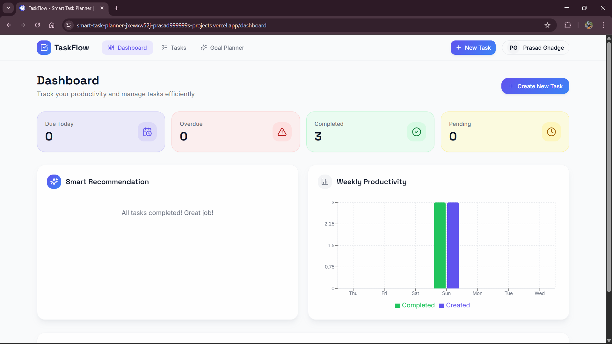
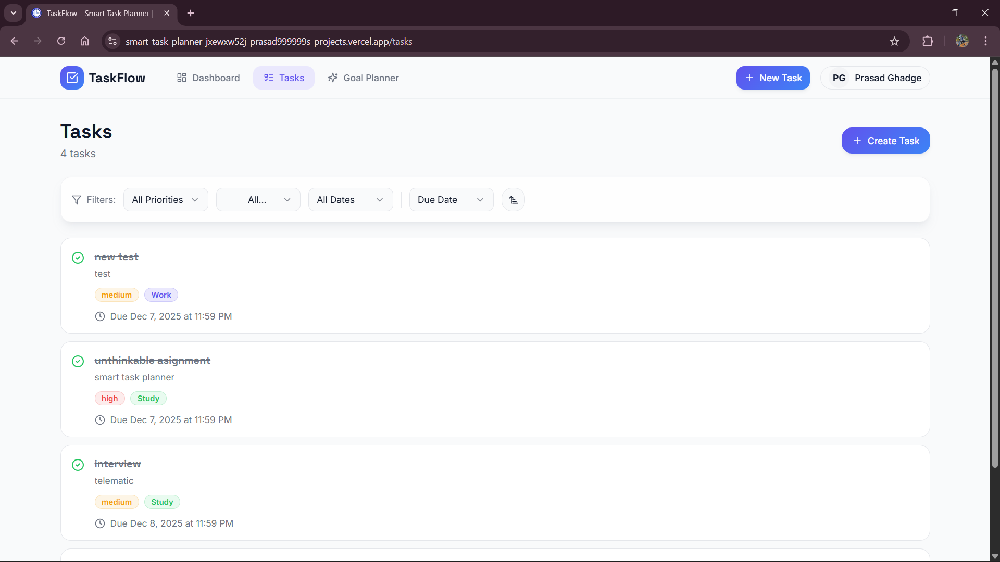
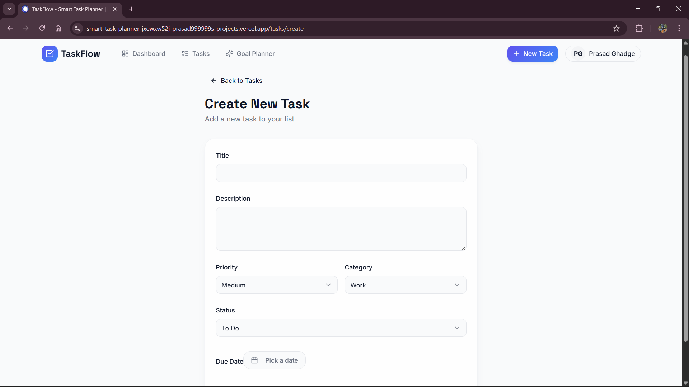
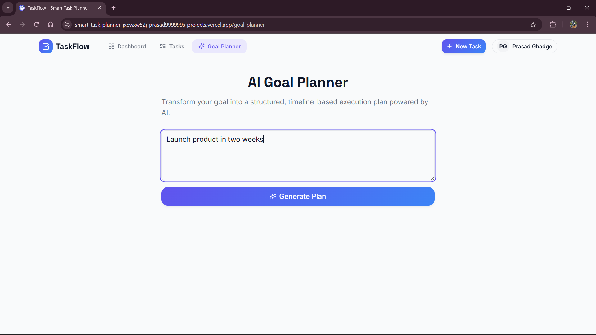
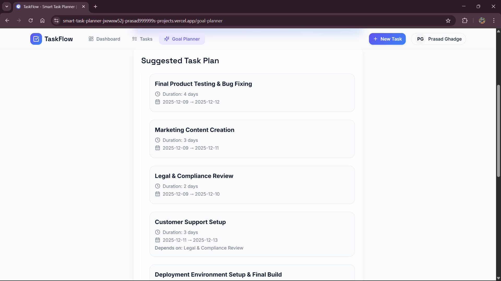

# 🧠 Smart Task Planner

A full–stack productivity system combining **task management**, **smart recommendations**, and **AI-powered goal breakdown**.

🔗 **Live App:** [https://smart-task-planner-prasad999999.vercel.app](https://smart-task-planner-prasad999999.vercel.app/)  
⚙️ **Backend API:** [https://smart-task-planner-9b1y.onrender.com/api/generate-plan](https://smart-task-planner-9b1y.onrender.com/api/generate-plan)  

---

## 🎥 Demo Video
Watch the full walkthrough → [Demo on Google Drive](https://drive.google.com/drive/folders/1_hGWSkzFworGMd9AuF9eztHWePy63y-V?usp=sharing)

---

# 🌟 Project Overview

Smart Task Planner is a hybrid project with **two major components**:

## **1️⃣ Task Management System**

A modern, user-friendly task manager with:

- Supabase Authentication
    
- CRUD Tasks
    
- Priority, Category, Status management
    
- Overdue detection
    
- Smart task scoring
    
- Dashboard analytics
    
- Fully responsive UI (ShadCN UI + Framer Motion)
    

## **2️⃣ AI Goal Breakdown System**

A separate feature required by the assignment:

> **Break a user goal into actionable tasks, dependencies, and timelines using LLM reasoning.**

This feature is implemented through:

- A dedicated **backend server (Node.js + Express)**
    
- A **/api/generate-plan** endpoint using **Gemini 2.5 Flash**
    
- A clean React-based **Goal Planner frontend page**
    

Both systems work independently but are included in a single repository as per deliverable guidelines.

---

# 🧱 Project Architecture

```
SMART-TASK-PLANNER/
│
├── smart-task-flow/               → Frontend (React + Vite)
│   ├── Supabase Auth
│   ├── Task Manager UI
│   └── AI Goal Planner UI
│
└── smart-task-flow-backend/       → Backend (Express + Gemini API)
    ├── /api/generate-plan
    ├── Prompt Engineering
    └── Timeline Computation Engine
```

---

# 🚀 Features

# **I. Task Management System**

## 🔐 Authentication (Supabase)

- Email/password signup
    
- Session persistence
    
- Protected pages
    
- User-based task storage
    

## 📝 Task CRUD

- Create, edit, delete tasks
    
- Fields:
    
    - title
        
    - description
        
    - due date
        
    - priority
        
    - category
        
    - status
        
- Automatic timestamping
    
- Timezone-safe due date handling
    

## 🧠 Smart Task Engine

Each task gets a **score** based on:

- Priority
    
- Deadline urgency
    
- Overdue penalty
    
- Recency
    

Score is used to compute:  
➡ **Recommended Task** (shown on dashboard)

## 📊 Dashboard Analytics

- Tasks completed today
    
- Tasks overdue
    
- Completion statistics
    
- 7-day productivity chart
    
- Animated transitions
    

## 🎨 Modern UI

- ShadCN components
    
- Tailwind CSS
    
- Framer Motion animations
    
- Glassmorphism UI
    
- Mobile-responsive design
    

---

# **II. AI Goal Breakdown System (Assignment Feature)**

## 🎯 Objective

From the user goal:

> “Launch a product in 2 weeks”

Generate:

- A sequence of structured tasks
    
- Dependencies
    
- Estimated durations
    
- Auto-calculated start/end dates based on timeline logic
    

---

## 🧠 LLM Reasoning

Using **Gemini 2.5 Flash**, the backend prompts the model to:

- Understand natural language goals
    
- Extract time frames
    
- Create actionable tasks
    
- Infer dependencies
    
- Generate timeline dates
    
- Output strict JSON
    

---

## 🎨 AI Goal Planner UI (Frontend)

The frontend includes a dedicated page:

➡ `/goal-planner`

With:

- Large text input
    
- Animated submit button
    
- Clean presentation of AI-generated tasks
    
- Framer Motion animations
    
- Dependency + timeline view
    

---

# 📦 Installation (Local Setup)

## 1️⃣ Clone the Repository

```sh
git clone https://github.com/prasad999999/SMART-TASK-PLANNER.git
cd SMART-TASK-PLANNER
```

---

## 2️⃣ Backend Setup

```sh
cd smart-task-flow-backend
npm install
```

Create `.env`:

```
GEMINI_API_KEY=your_gemini_api_key
```

Run backend:

```sh
npm run dev
```

Backend will run at:  
📍 [http://localhost:5000](http://localhost:5000/)

---

## 3️⃣ Frontend Setup

```sh
cd smart-task-flow
npm install
npm run dev
```

Frontend will run at:  
📍 [http://localhost:5173](http://localhost:5173/)

---

## 📸 Screenshots

### Dashboard


### Tasks Page


### Create Task


### Recommended Task


### AI Goal Planner – Input


### AI Goal Planner – Output


### Backend API Test


---

